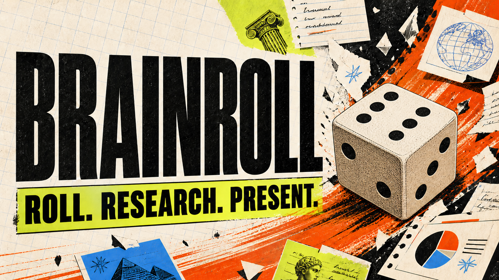

<div align="center">



# BRAINROLL

### Roll. Research. Present.

**Un jeu web de speedrun culturel : tire un sujet au hasard, apprends tout ce que tu peux en une heure, puis défends ce que tu as compris.**

[Aperçu privé](https://brainroll.allison-bon-ecochard.chatgpt.site) · [Signaler un problème](https://github.com/AllieEco/brainroll/issues)

</div>

---

## Le concept

Brainroll transforme la recherche documentaire en défi chronométré.

1. **ROLL** — lance les dés et découvre un sujet inattendu ;
2. **RESEARCH** — cherche, collecte tes sources et prends des notes ;
3. **UNDERSTAND** — organise tes idées et crée des flashcards ;
4. **BUILD** — construis ta présentation avant la fin du chrono ;
5. **PRESENT** — à `00:00`, tout est verrouillé : il faut présenter ce que tu sais.

> Aujourd'hui, tu vas devenir temporairement expert d'un sujet dont tu ne savais absolument rien il y a une heure.

Brainroll est pensé d'abord comme un **jeu**, notamment pour les streamers et leur audience. Il peut également être utilisé seul, entre amis, en classe ou dans un cadre pédagogique.

## Fonctionnalités actuelles

- tirage animé parmi une base locale de sujets ;
- catégories, niveaux de difficulté et contraintes aléatoires ;
- chrono persistant de 60 minutes ;
- verrouillage automatique basé sur l'heure réelle de fin ;
- autosauvegarde locale de la session ;
- éditeur de notes ;
- collection de sources ;
- création de flashcards ;
- carte mentale avec nœuds déplaçables et colorables ;
- export de la carte mentale en PNG ;
- insertion directe d'une carte mentale dans les slides ;
- éditeur de slides avec couleurs, images et plusieurs formats ;
- mode présentation plein écran avec navigation clavier ;
- abandon de partie protégé par une confirmation.

## Lancer Brainroll en local

### Prérequis

- Node.js `>= 22.13.0`
- npm

### Installation

```bash
git clone https://github.com/AllieEco/brainroll.git
cd brainroll
npm install
npm run dev
```

Ouvre ensuite [http://localhost:3000](http://localhost:3000).

### Vérifier la version de production

```bash
npm run build
```

## Stack

- React 19
- TypeScript
- Tailwind CSS 4
- vinext / Vite
- Cloudflare Workers via OpenAI Sites
- `localStorage` pour la persistance du MVP

## Données et confidentialité

Le MVP ne nécessite aucun compte et n'envoie pas le contenu des sessions vers une base de données. Les notes, sources, flashcards, cartes mentales et slides sont conservées dans le stockage local du navigateur.

Les images ajoutées aux slides sont limitées à environ 2,5 Mo afin de ne pas saturer ce stockage.

## Structure du projet

```text
app/
├── page.tsx        # boucle de jeu et workspace
├── globals.css     # direction visuelle et responsive
└── layout.tsx      # métadonnées du site
public/
└── brainroll-cover-v2.png  # carte de partage Brainroll
worker/
└── index.ts        # point d'entrée Cloudflare
```

## Contrôles de présentation

| Touche | Action |
| --- | --- |
| `→` ou `Espace` | Slide suivante |
| `←` | Slide précédente |
| `Échap` | Quitter la présentation |

## Roadmap

- [ ] bibliothèque de sujets plus large ;
- [ ] durées et modes de jeu alternatifs ;
- [ ] véritable éditeur de slides libre ;
- [ ] export PDF et PPTX ;
- [ ] Audience Mode pour le streaming ;
- [ ] sessions partagées et mode duel ;
- [ ] historique, statistiques et achievements ;
- [ ] sauvegarde optionnelle dans le cloud.

## État du projet

Brainroll est actuellement un **MVP jouable**. Son objectif est de valider une question simple :

> Est-ce que faire un Brainroll est réellement amusant ?

Les retours, idées et rapports de bugs sont les bienvenus dans les [issues GitHub](https://github.com/AllieEco/brainroll/issues).

---

<div align="center">

**Less brainrot. More brain.**

</div>
